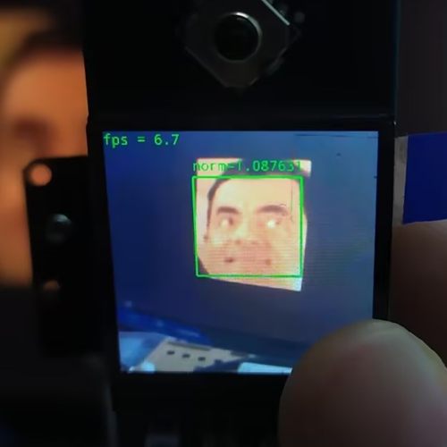

# Luckfox_Pico_rknn_example
[中文](./README_CN.md)
+ This demo is based on RKNN and OpenCV-Mobile for image capture, image processing, and image recognition inference.
+ The inference results can be displayed on a TFT screen or terminal.
+ Model conversion scripts based on RKNN-Toolkit2 are provided.
+ This convolutional neural network inference demo is specifically designed for the Luckfox Pico series development boards.

## Implementation Results
### luckfox_retinaface_facenet


### luckfox_yolov5


## Platform Support
Demo | System | Camera | Screen |
--- | --- | --- | ---
luckfox_pico_retinaface_facenet        | Buildroot | sc3336 | Pico-1.3-LCD LF40-480480-ARK
luckfox_pico_retinaface_facenet_spidev | Buildroot | sc3336 | Pico-ResTouch-LCD-2.8 Pico-ResTouch-LCD-3.5
luckfox_pico_yolov5                    | Buildroot | sc3336 | Pico-1.3-LCD LF40-480480-ARK 

**Note**: The Luckfox Pico supports different screens. You can refer to the [Compatibility List](https://wiki.luckfox.com/zh/Luckfox-Pico/Luckfox-Pico-Support-List) for details. If a compatible screen is not available, you can also view the inference results via the terminal.

## Compilation
+ Set environment variables
    ```
    export LUCKFOX_SDK_PATH=<path to luckfox-pico SDK>
    ```
    **Note**: Use the absolute path.
+ Obtain the repository source code and set execution permissions for the automatic build script
    ```
    chmod a+x ./build.sh
    ./build.sh
    ```
+ After running `./build.sh`, select the demo to compile
    ```
    1) luckfox_pico_retinaface_facenet
    2) luckfox_pico_retinaface_facenet_spidev
    3) luckfox_pico_yolov5
    Enter your choice [1-3]:
    ```
+ The `luckfox_pico_retinaface_facenet_spidev` option is specifically adapted for Pico-ResTouch-LCD. You need to select the Luckfox Pico model to determine the pin configuration.
    ```
    1) LUCKFOX_PICO_PLUS
    2) LUCKFOX_PICO_PRO_MAX
    Enter your choice [1-2]:
    ```

## Execution
+ After compilation, the corresponding **deployment folder** will be generated in the `install` directory (referred to as `<Demo Dir>` below).
    ```
    luckfox_pico_retinaface_facenet_demo
    luckfox_pico_retinaface_facenet_spidev_pro_max_demo
    luckfox_pico_retinaface_facenet_spidev_plus_demo
    luckfox_pico_yolov5_demo
    ```
+ Upload the generated `<Demo Dir>` to the Luckfox Pico (using adb, ssh, etc.), and then run:
    ```
    # Run on the Luckfox Pico board, where <Demo Target> is the executable in the deployment folder
    cd <Demo Dir>
    chmod a+x <Demo Target>
    ```
+ luckfox_pico_retinaface_facenet
    ```
    ./luckfox_pico_retinaface_facenet <retinaface model> <facenet model> <reference image>
    #Example: ./luckfox_pico_retinaface_facenet ./model/RetinaFace.rknn ./model/mobilefacenet.rknn ./model/test.jpg
    ```
+ luckfox_pico_retinaface_facenet_spidev
    ```
    ./luckfox_pico_retinaface_facenet_spidev <retinaface model> <facenet model> <reference image>
    #Example: ./luckfox_pico_retinaface_facenet_spidev ./model/RetinaFace.rknn ./model/mobilefacenet.rknn ./model/test.jpg
    ```
+ luckfox_pico_yolov5
    ```
    ./luckfox_pico_yolov5 <yolov5 model> 
    #Example: ./luckfox_pico_yolov5 ./model/yolov5.rknn
    ```

## Notes
+ Before running the demo, please execute `RkLunch-stop.sh` to stop the default background process `rkicp` that is started by Luckfox Pico at boot, releasing the camera for use.
+ The RKNN models and related configuration files for the demos are placed in the `<Demo Dir>/model` directory, allowing for quick validation.

## Model Conversion
[Model Conversion](scripts/luckfox_onnx_to_rknn/README.md)

## Detial
[RKNN Inference Test](https://wiki.luckfox.com/Luckfox-Pico/Luckfox-Pico-RV1106/Luckfox-Pico-Ultra-W/Luckfox-Pico-RKNN-Test/)

