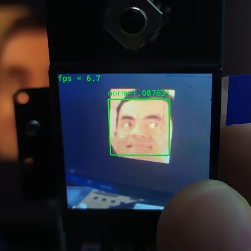
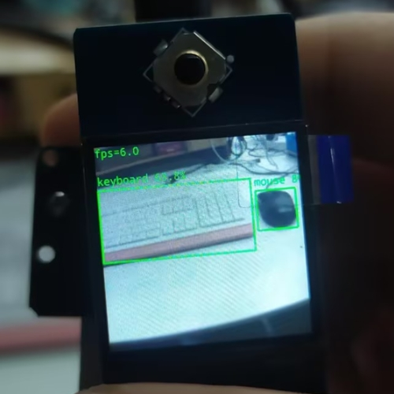

# Luckfox Pico RKNN example
[English](./README.md)
+ 本例程基于 RKNN 和 Opencv-Mobile 实现图像捕获、图像处理和图像识别推理
+ 使用 TFT 屏幕或终端显示推理结果
+ 提供基于 RKNN-Toolkit2 的模型转换脚本
+ 专为 Luckfox Pico 系列开发板提供的卷积神经网络推理例程

## 实现效果
### retinaface_facenet


### yolov5


## 平台支持
Demo | System | Camera | Screen |
--- | --- | --- | ---
luckfox_pico_retinaface_facenet        | Buildroot | sc3336 | Pico-1.3-LCD LF40-480480-ARK
luckfox_pico_retinaface_facenet_spidev | Buildroot | sc3336 | Pico-ResTouch-LCD-2.8 Pico-ResTouch-LCD-3.5
luckfox_pico_yolov5                    | Buildroot | sc3336 | Pico-1.3-LCD LF40-480480-ARK 

**注意**：Luckfox Pico 对屏幕的支持不同，可以参考[兼容性清单](https://wiki.luckfox.com/zh/Luckfox-Pico/Luckfox-Pico-Support-List)，如果没有适配的屏幕也可以使用终端查看推理结果。

## 编译
+ 设置环境变量
    ```
    export LUCKFOX_SDK_PATH=< luckfox-pico Sdk 地址>
    ```
    **注意**：使用绝对地址。
+ 获取仓库源码并设置自动编译脚本执行权限
    ```
    chmod a+x ./build.sh
    ./build.sh
    ```
+ 执行 ./build.sh 后选择编译的例程
    ```
    1) luckfox_pico_retinaface_facenet
    2) luckfox_pico_retinaface_facenet_spidev
    3) luckfox_pico_yolov5
    Enter your choice [1-3]:
    ```
+ luckfox_pico_retinaface_facenet_spidev 选项是专为 Pico-ResTouch-LCD 适配的例程，需要选择使用的 Luckfox Pico 型号来确定引脚
    ```
    1) LUCKFOX_PICO_PLUS
    2) LUCKFOX_PICO_PRO_MAX
    Enter your choice [1-2]:
    ```

## 运行
+ 编译完成后会在 install 文件夹下生成对应的**部署文件夹**（后续用<Demo Dir>表示）
    ```
    luckfox_pico_retinaface_facenet_demo
    luckfox_pico_retinaface_facenet_spidev_pro_max_demo
    luckfox_pico_retinaface_facenet_spidev_plus_demo
    luckfox_pico_yolov5_demo
    ```
+ 将生成的<Demo Dir>完整上传到 Luckfox Pico 上 (可使用adb ssh等方式) ，执行
    ```
    #在 Luckfox Pico 板端运行，<Demo Target> 是部署文件夹中的可执行程序
    cd <Demo Dir>
    chmod a+x <Demo Target>
    ```
+ luckfox_pico_retinaface_facenet
    ```
    ./luckfox_pico_retinaface_facenet <retinaface模型> <facenet模型> <参考图像> 
    #示例：./luckfox_pico_retinaface_facenet ./model/RetinaFace.rknn ./model/mobilefacenet.rknn ./model/test.jpg
    ```
+ luckfox_pico_retinaface_facenet_spidev
    ``` 
    ./luckfox_pico_retinaface_facenet_spidev <retinaface模型> <facenet模型> <参考图像>
    #示例：./luckfox_pico_retinaface_facenet_spidev ./model/RetinaFace.rknn ./model/mobilefacenet.rknn ./model/test.jpg
    ```
+ luckfox_pico_yolov5
    ```   
    ./luckfox_pico_yolov5 <yolov5模型> 
    #示例：./luckfox_pico_yolov5 ./model/yolov5.rknn
    ```

## 注意
+ 在运行demo前请执行 RkLunch-stop.sh 关闭 Luckofox Pico 开机默认开启的后台程序 rkicp ,解除对摄像头的占用
+ 例程相关的 RKNN 模型和相关配置文件放置在 <Demo Dir>/model 中，可以快速进行验证

## 模型转换
[模型转换](scripts/luckfox_onnx_to_rknn/README_CN.md)

## 详细
[RKNN推理测试](https://wiki.luckfox.com/zh/Luckfox-Pico/Luckfox-Pico-RV1106/Luckfox-Pico-Ultra-W/Luckfox-Pico-RKNN-Test/)
